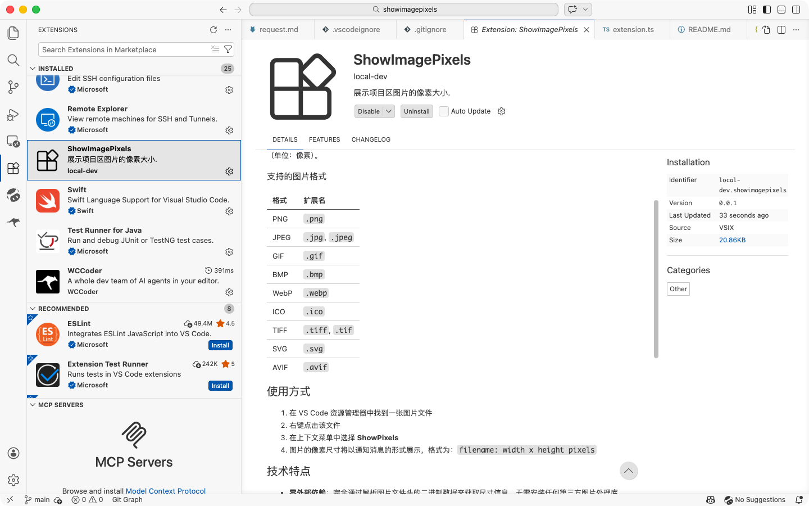
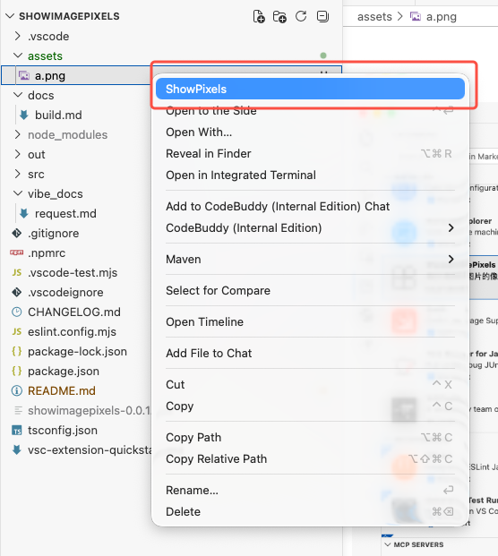
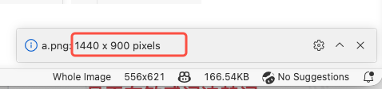

# ShowImagePixels

一个轻量级的 VS Code 扩展，用于在资源管理器中快速查看图片的像素尺寸。

## 功能

在 VS Code 资源管理器中右键点击图片文件，选择 **ShowPixels** 命令，即可在通知栏中显示该图片的宽度和高度（单位：像素）。

### 支持的图片格式

| 格式 | 扩展名 |
|------|--------|
| PNG | `.png` |
| JPEG | `.jpg`, `.jpeg` |
| GIF | `.gif` |
| BMP | `.bmp` |
| WebP | `.webp` |
| ICO | `.ico` |
| TIFF | `.tiff`, `.tif` |
| SVG | `.svg` |
| AVIF | `.avif` |

## 使用方式

1. 在 VS Code 资源管理器中找到一张图片文件
2. 右键点击该文件
3. 在上下文菜单中选择 **ShowPixels**
4. 图片的像素尺寸将以通知消息的形式展示，格式为：`filename: width x height pixels`

## 技术特点

- **零外部依赖**：完全通过解析图片文件头的二进制数据来获取尺寸信息，无需安装任何第三方图片处理库
- **高性能**：仅读取文件头部（最多 40KB），不加载整个图片文件
- **格式全面**：支持 PNG、JPEG、GIF、BMP、WebP（VP8/VP8L/VP8X）、ICO、TIFF（大端/小端）、SVG 等主流图片格式

## 系统要求

- VS Code `^1.110.0`

## 安装

### 从 VSIX 文件安装

1. 获取 `.vsix` 文件（参见项目中的 `docs/build.md` 了解如何从源码构建）
2. 打开 VS Code
3. 按 `Ctrl+Shift+P`（macOS: `Cmd+Shift+P`）打开命令面板
4. 输入 `Extensions: Install from VSIX...`
5. 选择 `.vsix` 文件完成安装

## License

## 展示

  
  
  
